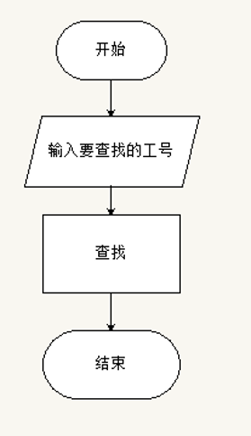

# Employee-Salary-Management-System
员工工资管理系统小程序

# 一、项目分析

员工工资管理系统用户需要的功能有：

添加员工的基本信息和工资数据：

1、录入员工信息

2、对员工工资进行排序

3、将员工的信息保存到硬盘上

4、通过员工的编号查询员工信息

5、修改员工信息

6、查看所有员工信息

7、删除员工信息

# 二、项目总体设计

员工工资管理系统功能模块设计如图


# 三、项目详细设计与实现

##  1、系统的整体处理模块

### 1）、系统的整体处理模块设计思路

系统执行的主流程为：进入主循环操作，显示主菜单，在判断键值时，输入1-8之间的任意数值，其他输入为错误按键。若输入8，则退出系统，输入1-7，则调用相关函数，执行相应操作。

系统的执行流程如图所示。


### 2）、系统的整体处理模块的编程实现

```c
int main()
{
    int j,num=0;
    WOK wok[SIZE];
    Sleep(500);//时间延迟500毫秒
    printf("\n\n\n\n\n\t\t\t\t系统加载中，请稍侯");
    Sleep(500);
    printf(".");
    Sleep(500);
    printf(".");
    Sleep(500);
    printf(".");
    Sleep(500);
    system("cls");
    printf("\n\n\n\n\n\t\t\t\t加载完成");
    Sleep(500);
    read(wok,&num);
    while(1)
    {
        system("cls");
        menu();
        scanf("%d",&j);
        switch(j)
        {
        case 1:
            input(wok,&num);
            break;
        case 2:
            sort(wok,num);
            break;
        case 3:
            save(wok,num);
            break;
        case 4:
            find(wok,num);
            break;
        case 5:
            modify(wok,&num);
            break;
        case 6:
            display(wok,num);
            break;
        case 7:
            del(wok,&num);
            break;
        case 8:exit(0);
        default:
            printf("输入错误，请重新输入！\n");
        }
    }
    return 0;
}

```

### 3）、系统的整体处理模块的运行效果

整体处理模块的总体运行效果如图所示。


## 2、查找功能模块

### 1）、查找功能模块的设计思路



### 2）、查找功能模块的编程实现

```c
void find(WOK *a,int n)
{
    int k=0;
    int m;
    WOK *p;
    system("cls");
    printf("\n请输入要查询的工号：");
    scanf("%d",&m);
    for(p=a; p<a+n; p++)
    {
        if(m==p->num)
        {
            k=1;
            printf("已找到该员工，具体信息为：\n");
	    printf("\t工号\t姓名\t工资\n");
            printf("\t%d\t%s\t%.1f\n",p->num,p->name,p->salary);
            break;
        }
    }
    if(!k)
        printf("找不到查询的员工！\n");
    printf("\n按任意键返回！！");
    getch();
}
   

```

### 3）、查找功能模块的运行效果

查找功能模块的总体运行效果如图所示。


## 3、排序功能模块

### 1）、排序功能模块的设计思路


### 2）、排序功能模块的编程实现

```c
void sort(WOK *a,int n)
{
    int i,j;
    WOK t;
    system("cls");
    for(i=0; i<n-1; i++)
    {
        for(j=0; j<n-i-1; j++)
        {
            if((a[j].salary)<(a[j+1].salary))
            {
                t=a[j];
                a[j]=a[j+1];
                a[j+1]=t;
            }
        }
    }
    printf("\n排序结果是：\n");
    printf("工号\t姓名\t工资\t\n");
    for(i=0; i<n; i++)
    {
        printf("%d\t%s\t%.1f\t\n",a[i].num,a[i].name,a[i].salary);
    }
    printf("\n按任意键返回！");
    getch();
}

```

### 3）、排序功能模块的运行效果

排序功能模块的总体运行效果如图所示。


## 4、输入功能模块

### 1）、输入功能模块的设计思路


### 2）、输入功能模块的编程实现

```c
void input(WOK *a,int *n)
{
    WOK *p;
    int n1;
    system("cls");
    printf("\n请输入员工的人数：");
    scanf("%d",&n1);
    printf("\n\t\t**********************");
    printf("\n\t\t*   工号  姓名  工资   *\n");
    printf("\t\t**********************\n");
    for(p=a+(*n);p<a+(n1)+(*n); p++)
    {
        printf("\t\t   ");
        scanf("%d%s\t%f",&p->num,p->name,&p->salary);
    }
    *n=*n+n1;
    printf("\n按任意键返回！！");
    getch();

}

```

### 3）、输入功能模块的运行效果


## 5、保存功能模块

### 1）、保存功能模块的设计思路


### 2）、保存功能模块的编程实现

```c
void save(WOK *a,int n)
{
    FILE *fp;
    WOK *p;
    int i;
    fp=fopen("c:\\woker.txt","w");
    for(p=a; p<a+n; p++)
    {
        fprintf(fp,"%10d%10s%10.1f\n",p->num,p->name,p->salary);
        printf("\n");
    }
    fclose(fp);
    printf("\n保存成功！");
    printf("\n按任意键返回！");
    getch();
}
    

```

### 3）、保存功能模块的运行结果


## 6、修改功能模块

### 1）、修改功能模块的设计思路


### 2）、修改功能模块的编程实现

```c
void modify(WOK *a,int *n)
{
    WOK *p;
    int k=0;
    int m;
    system("cls");
    printf("\n请输入要修改的员工编号：");
    scanf("%d",&m);
    for(p=a; p<a+*n; p++)
    {
        if(m==p->num)
        {
            k=1;
            scanf("%d%s%f",&p->num,p->name,&p->salary);
            printf("信息修改成功\n");
            break;
        }
    }
    if(!k)
        printf("找不到要修改的员工！\n");
    printf("按任意键继续\n");
    getch();
}

```

### 3）、修改功能模块的运行结果


## 7、输出功能模块

### 1）、输出功能模块的设计思路


### 2）、输出功能模块的编程实现

```c
void display(WOK *a,int n)
{
    WOK *p;
system("cls");
printf("\t工号\t姓名\t工资\n");
    for(p=a; p<a+n; p++)
    {
        printf("\t%d\t%s\t%.1f\n",p->num,p->name,p->salary);
        printf("\n");
    }
    printf("\n按任意键返回！！");
    getch();
}

```

### 3）、输出功能模块的运行结果


## 8、删除功能模块

### 1）、删除功能模块的设计思路


### 2）、删除功能模块的编程实现

```c
void del(WOK *a,int *n)
{
    int i,j,k=0;
    WOK *p;
    float num;
    system("cls");
    printf("\n请输入要删除的工号：");
    scanf("%f",&num);
    for(i=0,p=a; p<a+*n; i++)
    {
        if(num==(p+i)->num)
        {
            k=1;
            for(j=i; j<*n-1; j++)
            {
                *(a+j)=*(a+j+1);
            }
            (*n)--;
            printf("删除成功！\n");
            break;
        }
    }
    if(!k)
        printf("找不到要删除的员工！\n");
    printf("\n按任意键返回！！");
    getch();
}

```

### 3）、删除功能模块的运行结果


